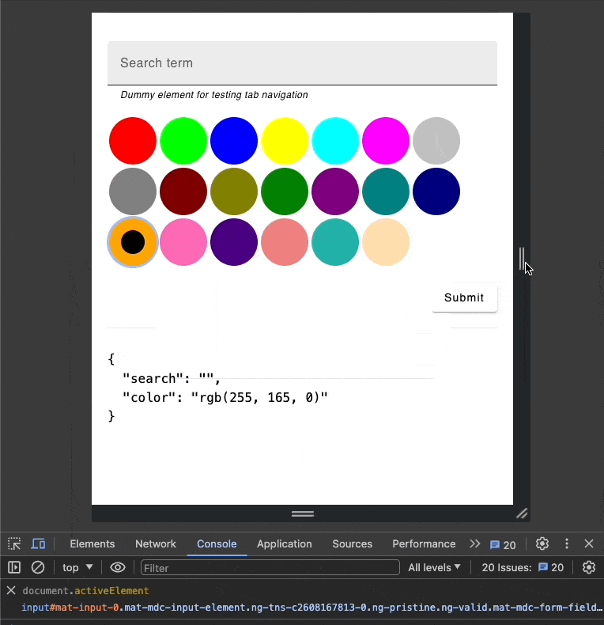

# Accessible Color Radio Control - `ColorGridSelectComponent`

## Overview

We would like to create a custom form control that is fully compatible with the **Angular Forms API**, i.e. it works with directives from both the `FormsModule` (`ngModel`) and `ReactiveFormsModule` (`formControl` & `formControlName`).

The custom form control used in this exercise is `ColorGridSelectComponent` and exhibits specific behavior in relation to HTML focus and the `activeElement` property

## Behaviors

The following characteristics ensure that the `ColorGridSelectComponent` behaves as an accessible, intuitive, and responsive custom form control, integrating seamlessly with keyboard navigation patterns and the Angular Forms API.

> Note: some of the behaviors may already be implemented and would be marked with a "✅"

### 1. Color Array and Grid Display

- ✅ The component takes an array of colors in the `rgb(255, 0, 0)` format and draws radio-like buttons depicting each color item in a responsive grid layout
- The grid adapts to the size of the container, ensuring a responsive design that looks good on various screen sizes
- ✅ `ColorGridItemComponent`
  - Each color item in the grid is represented by its own component, which accepts three inputs
    - `value`: `string`
    - `checked`: `boolean`
    - `disabled`: `boolean`



### 2. Mimicking Radio Group Behavior

- ✅ The component mimics the behavior of a radio group, where only one color item can be selected at a time
- ✅ Selecting a new color item automatically deselects any previously selected item


### 3. Form API Integration

- ✅ The selected item's value is accessible via the **Angular Forms API directives** (`ngModel` for `FormsModule` and `formControl` & `formControlName` for `ReactiveFormsModule`)


> _This integration ensures that the component can be easily used within Angular forms, providing a seamless form control experience_

### 4. Tab Navigation

- ✅ Receiving Focus
  - When the user presses the `Tab` key, the focus moves to the next focusable element in the DOM. If the `ColorGridSelectComponent` is the next element, it receives focus.
  - Upon receiving focus, the component's currently active color item (the one that is selected or highlighted) becomes the `activeElement`. This means the browser's focus moves to this specific color item within the component, making it the focal point for keyboard interactions.
- ✅ Losing Focus
  - If the user presses the `Tab` key again while the `ColorGridSelectComponent` is focused, the focus will move to the next focusable element in the DOM. The component then loses focus, and none of its internal elements are the `activeElement` anymore.


### 5. Arrow Key Navigation

- ✅ While the `ColorGridSelectComponent` is in focus, it listens for arrow key inputs (`Up`, `Down`, `Left`, `Right`)
- The navigation is managed such that the focused color item within the component updates accordingly, maintaining the `activeElement` as the current color item being navigated to by the user
- **Navigation:** Arrow key navigation should reflect visual layout:
  - **Up Arrow:** Moves selection to the item directly above
  - **Right Arrow:** Moves to the next item to the right, or wraps to the first item in the next row if at the end of a row
  - **Down Arrow:** At the end of the list, wraps back to the top item in the same column. If pressed on other items, moves to the item directly below
  - **Left Arrow:** Moves to the previous item to the left, or wraps to the last item in the previous row if at the beginning of a row
- ✅ Navigation to a color item automatically updates the form control value


### 6. Accessibility

- The grid & item should have relevant ARIA roles as needed, like `radiogroup`, `option` etc
- Enhance the component's accessibility, ensuring it is usable with screen readers and supports keyboard navigation effectively

> Refer to [`MatSelectionList`](https://github.com/angular/components/blob/main/src/material/list/selection-list.ts) and [`MatListOption`](https://github.com/angular/components/blob/main/src/material/list/list-option.ts) on how to enhance accessibility using native html elements (`radio`) underneath your custom form control component.

> We find the use-case of [emoji-mart](https://github.com/missive/emoji-mart) library is similar to the expectation of this assessment - managing the dynamic width of the layout and accessible navigation between elements with keyboard.
> You can find the width related observer code [here](https://github.com/missive/emoji-mart/blob/main/packages/emoji-mart/src/components/Picker/Picker.tsx#L250) and navigation related code [here](https://github.com/missive/emoji-mart/blob/main/packages/emoji-mart/src/components/Picker/Picker.tsx#L474).

## Bonus Challenge

### Storybook

- Create Storybook stories for both `ColorGridSelectComponent` and `ColorGridItemComponent`
- Demonstrate different states (default, selected, disabled) and ensure the components' functionality is clearly showcased
- Implement [Interaction tests](https://storybook.js.org/docs/writing-tests/interaction-testing)

You can launch the integrated storybook with the following command

```sh
npx nx run ng-ui-components:storybook
```

### Signal Inputs

- Take it further to the newer version of Angular and implement [Signal Inputs](https://blog.angular.io/signal-inputs-available-in-developer-preview-6a7ff1941823) wherever possible
- Be wary that you may need use a hack to support Storybook
  - Read [#25784](https://github.com/storybookjs/storybook/issues/25784) and [#26413](https://github.com/storybookjs/storybook/pull/26413) for more information

### Unit Tests

- Write unit tests for the `ColorGridSelectComponent`, covering key functionalities such as input handling, grid layout calculation, navigation and value changes.

## Resources

- [Angular Custom Form Controls](https://blog.angular-university.io/angular-custom-form-controls/)
- [ResizeObserver](https://developer.mozilla.org/en-US/docs/Web/API/ResizeObserver)
  - [emoji-mart implementation](https://github.com/missive/emoji-mart/blob/main/packages/emoji-mart/src/components/Picker/Picker.tsx#L250)
- Arrow Navigation
  - [FocusKeyManager](https://material.angular.io/cdk/a11y/overview#focuskeymanager)
    - [Accessibility Made Easy with Angular CDK](https://netbasal.com/accessibility-made-easy-with-angular-cdk-1caaf3d98de2)
  - [emoji-mart implementation](https://github.com/missive/emoji-mart/blob/main/packages/emoji-mart/src/components/Picker/Picker.tsx#L474)
- Accessibility
  - <https://github.com/angular/components/blob/main/src/material/list/selection-list.ts>
  - <https://github.com/angular/components/blob/main/src/material/list/list-option.ts>
- Storybook
  - [How to write stories](https://storybook.js.org/docs/writing-stories)
  - [Interaction tests
    ](https://storybook.js.org/docs/writing-tests/interaction-testing)
- Nx
  - [Intro to Nx](https://nx.dev/getting-started/intro)
  - [Angular Monorepo Tutorial](https://nx.dev/angular-tutorial/1-code-generation)
  - [Using Tailwind CSS with Angular projects](https://nx.dev/recipes/angular/using-tailwind-css-with-angular-projects)

## StarterKit jump start

### Sample app

The sample app includes a form with multiple focusable elements, such as input text fields and buttons, surrounding the `ColorGridSelectComponent`.


This environment allows you to test and verify the focus management and accessibility features of the `ColorGridSelectComponent` within a real-world form context.

You can launch the app using the following command:

```sh
npx nx run ng-web:serve
```

### ColorGridSelectComponent

The `ColorGridSelectComponent` is the custom form control designed to mimic the behavior of a radio group. It is partially implemented with support for:

- Receiving and losing focus
- Radio-like behavior, allowing only one color item to be selected at a time
- Left and right arrow key navigation to move between color items using [`FocusKeyManager`](https://material.angular.io/cdk/a11y/overview#focuskeymanager)
- Selection of a color item automatically updates the form control value
